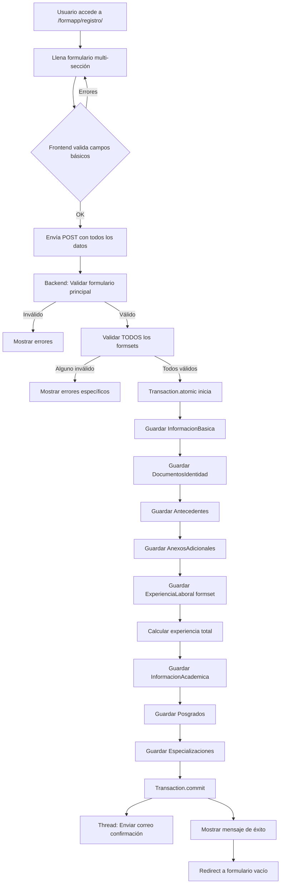
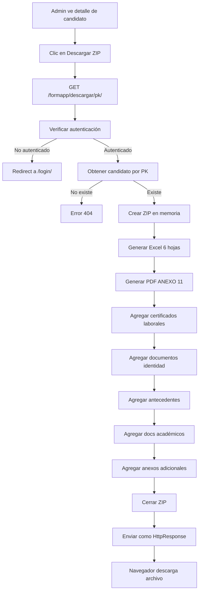
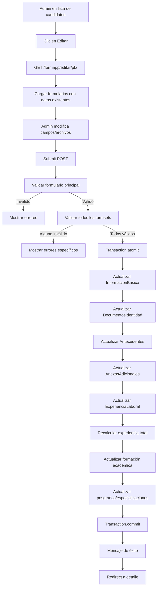

# Análisis Completo del Sistema de Gestión Humana CHVS

**Fecha de análisis:** 24 de Noviembre de 2025
**Proyecto:** Sistema de Gestión de Recursos Humanos - CAVIJUP
**Framework:** Django 5.2.7
**Lenguaje:** Python 3.x

---

## 📋 Tabla de Contenidos

1. [Resumen Ejecutivo](#resumen-ejecutivo)
2. [Arquitectura del Sistema](#arquitectura-del-sistema)
3. [Stack Tecnológico](#stack-tecnológico)
4. [Features y APIs Principales](#features-y-apis-principales)
5. [Modelos de Datos](#modelos-de-datos)
6. [Seguridad y Validaciones](#seguridad-y-validaciones)
7. [Generación de Reportes](#generación-de-reportes)
8. [Flujos de Trabajo](#flujos-de-trabajo)
9. [Análisis de Calidad](#análisis-de-calidad)
10. [Recomendaciones](#recomendaciones)

---

## 🎯 Resumen Ejecutivo

El **Sistema de Gestión Humana CHVS** es una aplicación web Django diseñada para la Secretaría de Bienestar Social de Cali (CAVIJUP) que permite:

- ✅ **Registro público de candidatos** con formulario multi-sección completo
- ✅ **Gestión administrativa** de expedientes de personal (CRUD)
- ✅ **Cálculo automático** de experiencia laboral certificada
- ✅ **Generación de reportes** en Excel, PDF (ANEXO 11) y ZIP
- ✅ **Almacenamiento en la nube** con Cloudinary
- ✅ **Validación exhaustiva** de documentos y archivos
- ✅ **Notificaciones por correo** mediante Gmail API

### Estado Actual
- **Complejidad:** Media-Alta
- **Líneas de código:** ~5,000
- **Mantenimiento:** Activo
- **Entorno:** Dual (Railway producción + Local desarrollo)

---

## 🏗️ Arquitectura del Sistema

### Estructura del Proyecto

```
GESTION_HUMANA_CHVS/
├── gestion_humana/               # Proyecto Django principal
│   ├── gestion_humana/           # Configuración del proyecto
│   │   ├── settings.py          # Configuración (DB, Cloudinary, Email)
│   │   ├── urls.py              # URLs principales
│   │   └── wsgi.py              # WSGI para producción
│   │
│   ├── formapp/                  # Aplicación principal
│   │   ├── models.py            # 9 modelos de datos relacionados
│   │   ├── forms.py             # Formularios y formsets
│   │   ├── validators.py        # Validadores personalizados
│   │   ├── services.py          # Lógica de negocio
│   │   ├── report_generators.py # Generación Excel/PDF
│   │   │
│   │   ├── views/               # Vistas refactorizadas
│   │   │   ├── __init__.py
│   │   │   ├── views_public.py  # Formulario público
│   │   │   ├── views_admin.py   # Panel administrativo
│   │   │   └── views_reports.py # Reportes ZIP
│   │   │
│   │   ├── templates/           # Templates HTML
│   │   └── migrations/          # 23 migraciones aplicadas
│   │
│   ├── static/                   # Archivos estáticos (CSS, JS)
│   ├── media/                    # Archivos locales (desarrollo)
│   └── db.sqlite3               # Base de datos local
│
├── requirements.txt              # Dependencias Python
└── testsprite_tests/            # Tests y análisis
```

### Tipo de Arquitectura
**Monolítica MVC (Django MVT)** - Todo en un solo proyecto Django con separación clara de responsabilidades.

---

## 🛠️ Stack Tecnológico

### Backend
| Componente | Tecnología | Versión | Propósito |
|------------|-----------|---------|-----------|
| **Framework** | Django | 5.2.7 | Framework web principal |
| **Lenguaje** | Python | 3.x | Lenguaje de programación |
| **Base de Datos** | PostgreSQL / SQLite | - | PostgreSQL en producción, SQLite en desarrollo |
| **WSGI Server** | Gunicorn | 23.0.0 | Servidor de aplicación para producción |

### Almacenamiento y Archivos
| Componente | Tecnología | Propósito |
|------------|-----------|-----------|
| **Cloud Storage** | Cloudinary | Almacenamiento de archivos multimedia (documentos, fotos) |
| **Static Files** | WhiteNoise | Servir archivos estáticos (CSS, JS) en producción |

### Reportes y Documentos
| Componente | Tecnología | Propósito |
|------------|-----------|-----------|
| **Excel** | openpyxl | Generación de reportes Excel con estilos |
| **PDF** | reportlab | Generación de PDF ANEXO 11 oficial |

### Comunicación
| Componente | Tecnología | Propósito |
|------------|-----------|-----------|
| **Email** | Gmail API | Envío de correos de confirmación |
| **Email Client** | google-api-python-client | Cliente para Gmail API |

### Utilidades
| Componente | Tecnología | Propósito |
|------------|-----------|-----------|
| **Config** | python-decouple | Gestión de variables de entorno |
| **Database URL** | dj-database-url | Parse de DATABASE_URL para Railway |
| **File Validation** | python-magic | Validación de tipo MIME real de archivos |
| **Timezone** | pytz | Manejo de zona horaria Colombia (America/Bogota) |

---

## 🎯 Features y APIs Principales

### 1. 📝 Registro Público de Candidatos

**Descripción:** Formulario público accesible sin autenticación para que candidatos registren su información completa.

**Endpoint:** `POST /formapp/registro/`

**Características:**
- ✅ Formulario multi-sección con 8 secciones
- ✅ Validación exhaustiva en cliente y servidor
- ✅ Cálculo automático de experiencia laboral
- ✅ Subida de múltiples documentos (hasta 10MB c/u)
- ✅ Envío asíncrono de correo de confirmación
- ✅ Transaction atomic para consistencia de datos

**Secciones del Formulario:**
1. **Información Básica** - Nombre, cédula (única), género, dirección, teléfono, correo
2. **Experiencia Laboral** - Múltiples registros con fechas, cargo, certificados
3. **Formación Académica** - Títulos universitarios, tarjetas profesionales
4. **Posgrados** - Maestrías, doctorados
5. **Especializaciones** - Estudios de especialización
6. **Documentos de Identidad** - Cédula 150%, hoja de vida, libreta militar
7. **Antecedentes** - 5 certificados (Procuraduría, Contraloría, Policía, RNMC, Delitos Sexuales)
8. **Anexos Adicionales** - ANEXO 03, carta de intención, otros

**Flujo de Validación:**
```
1. Usuario llena formulario
2. Frontend: Validación básica (required, formato)
3. Backend: Validación Django forms
4. Backend: Validación de TODOS los formsets
5. SI todo válido:
   - Transaction.atomic() inicia
   - Guarda InformacionBasica
   - Guarda DocumentosIdentidad
   - Guarda Antecedentes
   - Guarda AnexosAdicionales
   - Guarda ExperienciaLaboral (formset)
   - Calcula experiencia total automáticamente
   - Guarda InformacionAcademica (formset)
   - Guarda Posgrados (formset)
   - Guarda Especializaciones (formset)
   - Transaction.commit()
   - Thread separado: Envía correo confirmación
   - Redirect con mensaje de éxito
6. SI hay errores:
   - Muestra errores específicos por sección
   - NO guarda nada (rollback implícito)
```

**Validaciones Aplicadas:**
- Cédula única (5-10 dígitos)
- Teléfono (10 dígitos)
- Email válido
- Archivos: tamaño máx 10MB, formatos PDF/JPG/PNG, MIME type real
- Fechas: fecha_inicial < fecha_terminacion en experiencia
- Campos requeridos vs opcionales según modelo

**Archivos Involucrados:**
```
gestion_humana/formapp/views/views_public.py       (vista principal)
gestion_humana/formapp/models.py                   (9 modelos)
gestion_humana/formapp/forms.py                    (formularios y formsets)
gestion_humana/formapp/services.py                 (calcular_experiencia_total)
gestion_humana/formapp/validators.py               (validate_file_*)
gestion_humana/formapp/templates/formapp/public_form.html
```

---

### 2. 👨‍💼 Panel Administrativo

**Descripción:** Sistema completo de gestión de candidatos registrados con autenticación requerida.

**Endpoints:**
- `GET /formapp/lista/` - Lista paginada de candidatos
- `GET /formapp/detalle/{pk}/` - Vista detallada de un candidato
- `GET/POST /formapp/editar/{pk}/` - Edición completa de registro
- `POST /formapp/eliminar/{pk}/` - Eliminación de registro

**Características:**

#### Lista de Candidatos (`ApplicantListView`)
- ✅ Paginación (20 registros por página)
- ✅ Búsqueda por cédula o nombre
- ✅ Estadísticas en dashboard:
  - Total personal registrado
  - Personal con experiencia laboral
  - Profesionales con título
  - Personal con posgrado
- ✅ Ordenamiento por ID descendente (más recientes primero)
- ✅ LoginRequiredMixin (requiere autenticación)

#### Detalle de Candidato (`ApplicantDetailView`)
- ✅ Vista completa de toda la información
- ✅ Muestra datos personales, experiencia, académica, documentos
- ✅ Enlaces para editar o descargar reportes

#### Edición de Candidato (`applicant_edit_view`)
- ✅ Formulario completo con todas las secciones
- ✅ Pre-carga de datos existentes
- ✅ Validación exhaustiva igual que registro
- ✅ Recálculo automático de experiencia al editar fechas
- ✅ Manejo especial de archivos (opcional en edición)
- ✅ Transaction atomic para consistencia
- ✅ Mensajes de error específicos por sección

#### Eliminación de Candidato (`applicant_delete_view`)
- ✅ Confirmación mediante POST
- ✅ Eliminación en cascada (todos los registros relacionados)
- ✅ Mensaje de confirmación con nombre del candidato
- ✅ Manejo de errores (ej: FK constraints)

**Autenticación:**
```python
# Vista basada en clase
class ApplicantListView(LoginRequiredMixin, ListView):
    ...

# Vista basada en función
@login_required
def applicant_edit_view(request, pk):
    ...
```

**Configuración de URLs:**
```python
LOGIN_URL = '/login/'
LOGIN_REDIRECT_URL = '/formapp/lista/'
LOGOUT_REDIRECT_URL = '/login/'
```

**Archivos Involucrados:**
```
gestion_humana/formapp/views/views_admin.py
gestion_humana/formapp/templates/formapp/applicant_list.html
gestion_humana/formapp/templates/formapp/applicant_detail.html
gestion_humana/formapp/templates/formapp/applicant_edit.html
```

---

### 3. 📊 Generación de Reportes - ZIP Individual

**Descripción:** Genera archivo ZIP completo con todos los documentos y reportes de un candidato.

**Endpoint:** `GET /formapp/descargar/{pk}/`

**Contenido del ZIP:**

```
{Nombre_Candidato}_Completo.zip
│
├── {Nombre_Candidato}_Informacion.xlsx       # Excel con 6 hojas
├── {Nombre_Candidato}_ANEXO_11.pdf           # PDF oficial ANEXO 11
│
├── Certificados_Laborales/
│   ├── 1_Profesional_Social.pdf
│   ├── 2_Coordinador_Tecnico.pdf
│   └── ...
│
├── Documentos_Identidad/
│   ├── Cedula.pdf
│   ├── Hoja_de_Vida.pdf
│   └── Libreta_Militar.pdf (si aplica)
│
├── Antecedentes/
│   ├── Procuraduria.pdf
│   ├── Contraloria.pdf
│   ├── Policia.pdf
│   ├── Medidas_Correctivas.pdf
│   └── Delitos_Sexuales.pdf
│
├── Documentos_Academicos/
│   ├── 1_Psicologia_Titulo.pdf
│   ├── 1_Psicologia_Tarjeta_Profesional.pdf
│   ├── 1_Psicologia_Certificado_Vigencia.pdf
│   └── ...
│
└── Anexos/
    ├── ANEXO_03_Datos_Personales.pdf
    ├── Carta_Intencion.pdf
    └── Otros_Documentos.pdf
```

**Características:**
- ✅ Generación en memoria (io.BytesIO) sin archivos temporales
- ✅ Detección automática de extensiones por MIME type
- ✅ Manejo robusto de errores (continúa si un archivo falla)
- ✅ Logging de errores sin interrumpir descarga
- ✅ Nombres de archivo seguros (replace espacios, barras)
- ✅ Compresión ZIP_DEFLATED

**Lógica de Detección de Extensión:**
```python
def get_file_extension(file_field, file_content):
    # 1. Intentar obtener extensión del nombre
    ext = os.path.splitext(file_field.name)[1]

    # 2. Si no hay, intentar desde URL
    if not ext and hasattr(file_field, 'url'):
        ext = '.' + url.split('/')[-1].split('.')[-1]

    # 3. Si no hay, detectar por MIME type
    if not ext:
        if file_content.startswith(b'%PDF'):
            ext = '.pdf'
        elif file_content.startswith(b'\x89PNG'):
            ext = '.png'
        elif file_content.startswith(b'\xff\xd8\xff'):
            ext = '.jpg'
        else:
            ext = '.pdf'  # default

    return ext
```

**Archivos Involucrados:**
```
gestion_humana/formapp/views/views_reports.py (download_individual_zip)
gestion_humana/formapp/report_generators.py
```

---

### 4. 📦 Generación de Reportes - ZIP Masivo

**Descripción:** Genera reporte completo de TODO el personal en un único archivo ZIP con timestamp.

**Endpoint:** `GET /formapp/descargar-todo/`

**Contenido del ZIP:**

```
Personal_Completo_20250124_143022.zip
│
├── Personal_Completo.xlsx                    # Excel consolidado con todos
│
└── Personal/
    ├── Juan_Perez/
    │   ├── Juan_Perez_Informacion.xlsx
    │   ├── Juan_Perez_ANEXO_11.pdf
    │   ├── Certificados_Laborales/
    │   ├── Documentos_Identidad/
    │   ├── Antecedentes/
    │   ├── Documentos_Academicos/
    │   └── Anexos/
    │
    ├── Maria_Lopez/
    │   ├── Maria_Lopez_Informacion.xlsx
    │   └── ...
    │
    └── ...
```

**Excel Consolidado (Personal_Completo.xlsx):**

| Cédula | Nombre | Género | Teléfono | Correo | Perfil | Área | Profesión | Contrato | Observaciones |
|--------|--------|--------|----------|--------|--------|------|-----------|----------|---------------|
| 1234567890 | JUAN PEREZ | Masculino | 3001234567 | juan@... | PROFESIONAL SOCIAL | SOCIAL | TRABAJADOR SOCIAL | PST | ... |
| ... | ... | ... | ... | ... | ... | ... | ... | ... | ... |

**Características:**
- ✅ Excel consolidado con tabla completa de personal
- ✅ Carpeta individual por cada persona con estructura completa
- ✅ Timestamp en nombre de archivo (YYYYMMDD_HHMMSS)
- ✅ Generación optimizada con funciones auxiliares reutilizables
- ✅ Manejo de errores robusto (continúa si una persona falla)

**Consideraciones de Performance:**
⚠️ **IMPORTANTE:** Este proceso carga TODOS los candidatos en memoria. Con cientos o miles de registros, puede ser problemático.

**Recomendación:** Para grandes volúmenes, considerar:
- Paginación del proceso
- Generación asíncrona con Celery
- Streaming del ZIP en chunks

**Archivos Involucrados:**
```
gestion_humana/formapp/views/views_reports.py (download_all_zip)
gestion_humana/formapp/report_generators.py
```

---

### 5. 🧮 Servicio de Cálculo de Experiencia

**Descripción:** Servicio interno que calcula automáticamente la experiencia laboral total sumando todos los períodos registrados.

**Función:** `calcular_experiencia_total(informacion_basica)`

**Cuándo se Ejecuta:**
- ✅ Automáticamente al guardar un nuevo registro (formulario público)
- ✅ Automáticamente al editar experiencias laborales (panel admin)
- ✅ Se recalcula cada vez que se modifican las fechas

**Proceso de Cálculo:**

```python
# Para cada ExperienciaLaboral del candidato:

# 1. Calcular días totales
delta = fecha_terminacion - fecha_inicial
total_dias = delta.days

# 2. Calcular meses completos considerando días
anos = fecha_fin.year - fecha_inicio.year
meses = fecha_fin.month - fecha_inicio.month
dias = fecha_fin.day - fecha_inicio.day

# Ajustar si días es negativo
if dias < 0:
    meses -= 1
    dias += dias_del_mes_anterior

# Ajustar si meses es negativo
if meses < 0:
    anos -= 1
    meses += 12

total_meses = (anos * 12) + meses

# 3. Guardar en ExperienciaLaboral
experiencia.meses_experiencia = total_meses
experiencia.dias_experiencia = total_dias

# 4. Sumar todas las experiencias
total_meses_todas = sum(exp.meses_experiencia for exp in experiencias)
total_dias_todos = sum(exp.dias_experiencia for exp in experiencias)

# 5. Calcular años con decimales
total_anos = total_dias_todos / 365.25

# 6. Calcular representación legible
anos_completos = total_meses_todas // 12
meses_restantes = total_meses_todas % 12
texto = f"{anos_completos} años y {meses_restantes} meses"

# 7. Guardar en CalculoExperiencia (OneToOne)
calculo = CalculoExperiencia.objects.update_or_create(
    informacion_basica=informacion_basica,
    defaults={
        'total_meses_experiencia': total_meses_todas,
        'total_dias_experiencia': total_dias_todos,
        'total_experiencia_anos': round(total_anos, 2),
        'anos_y_meses_experiencia': texto
    }
)
```

**Ejemplo de Resultado:**
```
Experiencia 1: 2020-01-15 a 2022-06-30 = 29 meses, 897 días
Experiencia 2: 2022-08-01 a 2024-12-31 = 29 meses, 883 días

TOTAL:
- Meses: 58 meses
- Días: 1780 días
- Años: 4.87 años
- Texto: "4 años y 10 meses"
```

**Modelos Involucrados:**
```python
# ExperienciaLaboral
- fecha_inicial (DateField)
- fecha_terminacion (DateField)
- meses_experiencia (IntegerField, readonly)
- dias_experiencia (IntegerField, readonly)

# CalculoExperiencia (OneToOne con InformacionBasica)
- total_meses_experiencia (IntegerField)
- total_dias_experiencia (IntegerField)
- total_experiencia_anos (DecimalField, 2 decimales)
- anos_y_meses_experiencia (CharField, texto legible)
```

**Archivos Involucrados:**
```
gestion_humana/formapp/services.py (calcular_experiencia_total)
gestion_humana/formapp/models.py (ExperienciaLaboral, CalculoExperiencia)
```

---

### 6. 🔐 Sistema de Autenticación

**Descripción:** Sistema integrado de Django para proteger vistas administrativas.

**Endpoints:**
- `GET/POST /login/` - Formulario de login
- `POST /logout/` - Cerrar sesión

**Configuración:**
```python
# settings.py
LOGIN_URL = '/login/'
LOGIN_REDIRECT_URL = '/formapp/lista/'
LOGOUT_REDIRECT_URL = '/login/'

# Cookies y sesiones
CSRF_COOKIE_SAMESITE = 'Lax'
SESSION_COOKIE_HTTPONLY = True

# Producción (Railway)
if not DEBUG:
    SESSION_COOKIE_SECURE = True
    CSRF_COOKIE_SECURE = True
    SECURE_SSL_REDIRECT = True
    SECURE_HSTS_SECONDS = 31536000
```

**Protección de Vistas:**

```python
# Vistas basadas en clase
from django.contrib.auth.mixins import LoginRequiredMixin

class ApplicantListView(LoginRequiredMixin, ListView):
    model = InformacionBasica
    ...

# Vistas basadas en función
from django.contrib.auth.decorators import login_required

@login_required
def applicant_edit_view(request, pk):
    ...
```

**Vistas Públicas (sin autenticación):**
- ✅ `/formapp/registro/` - Formulario público de registro

**Vistas Protegidas (requieren login):**
- 🔒 `/formapp/lista/` - Lista de candidatos
- 🔒 `/formapp/detalle/{pk}/` - Detalle de candidato
- 🔒 `/formapp/editar/{pk}/` - Editar candidato
- 🔒 `/formapp/eliminar/{pk}/` - Eliminar candidato
- 🔒 `/formapp/descargar/{pk}/` - Descargar ZIP individual
- 🔒 `/formapp/descargar-todo/` - Descargar ZIP masivo

---

### 7. 📁 Servicio de Validación de Archivos

**Descripción:** Validación exhaustiva de archivos subidos en 3 niveles.

**Validadores:**

#### 1. `validate_file_size(value)`
```python
max_size = 10 * 1024 * 1024  # 10 MB

if value.size > max_size:
    raise ValidationError(
        f'El archivo es muy grande. Tamaño máximo: 10 MB. '
        f'Tu archivo: {value.size / (1024*1024):.2f} MB'
    )
```

#### 2. `validate_file_extension(value)`
```python
allowed_extensions = ['.pdf', '.jpg', '.jpeg', '.png']
ext = os.path.splitext(value.name)[1].lower()

if ext not in allowed_extensions:
    raise ValidationError(
        f'Formato no permitido: {ext}. '
        f'Formatos aceptados: PDF, JPG, PNG'
    )
```

#### 3. `validate_file_mime(value)`
```python
import magic

allowed_mimes = [
    'application/pdf',
    'image/jpeg',
    'image/png'
]

# Leer primeros bytes para detectar tipo real
file_content = value.read(2048)
value.seek(0)

mime = magic.from_buffer(file_content, mime=True)

if mime not in allowed_mimes:
    raise ValidationError(
        f'Tipo de archivo no válido. '
        f'El archivo parece ser: {mime}'
    )
```

**Aplicación en Modelos:**
```python
class DocumentosIdentidad(models.Model):
    fotocopia_cedula = models.FileField(
        upload_to='documentos_identidad/cedulas/',
        validators=[
            validate_file_size,
            validate_file_extension,
            validate_file_mime
        ],
        help_text='PDF, JPG, PNG. Máx: 10 MB'
    )
```

**Seguridad:**
- ✅ Previene subida de archivos ejecutables disfrazados
- ✅ Valida extensión Y contenido real (MIME type)
- ✅ Mensajes de error claros para el usuario
- ✅ Límite de tamaño para prevenir DoS

---

### 8. 📧 Servicio de Notificaciones por Email

**Descripción:** Envío asíncrono de correos de confirmación usando Gmail API.

**Función:** `enviar_correo_confirmacion(informacion_basica)`

**Configuración:**
```python
# settings.py
DEFAULT_FROM_EMAIL = 'erp.planeacion@vallesolidario.com'

# Variables de entorno
GMAIL_TOKEN_JSON  # Railway (producción)
# o
token.json  # Archivo local (desarrollo)
```

**Flujo de Envío:**
```python
# En views_public.py después de guardar registro:

def enviar_correo_async():
    try:
        enviar_correo_confirmacion(informacion_basica)
    except Exception as e:
        logger.error(f'Error en correo: {str(e)}')

# Thread separado (no bloquea respuesta)
thread = threading.Thread(target=enviar_correo_async)
thread.daemon = True
thread.start()

# Continúa inmediatamente sin esperar
messages.success(request, 'Formulario enviado con éxito!')
return redirect('formapp:public_form')
```

**Contenido del Email:**
```
De: erp.planeacion@vallesolidario.com
Para: {correo_candidato}
Asunto: Confirmación de Registro - CAVIJUP

Estimado/a {nombre_completo},

Su registro ha sido recibido exitosamente el {fecha} a las {hora}
(hora de Colombia).

Datos registrados:
- Cédula: {cedula}
- Correo: {correo}
- Teléfono: {telefono}

Su información será revisada por nuestro equipo de Gestión Humana.

Atentamente,
CAVIJUP - Secretaría de Bienestar Social
```

**Características:**
- ✅ Ejecución asíncrona (thread separado, daemon=True)
- ✅ Zona horaria Colombia (America/Bogota con pytz)
- ✅ Template HTML personalizable
- ✅ Fail silently (no interrumpe registro si falla)
- ✅ Logging de errores para debugging

**Manejo de Errores:**
```python
try:
    enviar_correo_confirmacion(informacion_basica)
except Exception as e:
    # Log error pero NO interrumpe el registro
    logger.error(f'Error en envío de correo: {str(e)}')
    # Usuario YA recibió mensaje de éxito del registro
```

---

### 9. ☁️ Servicio de Almacenamiento en la Nube

**Descripción:** Integración con Cloudinary para almacenamiento centralizado de archivos.

**Configuración:**
```python
# settings.py
CLOUDINARY_STORAGE = {
    'CLOUD_NAME': config('CLOUDINARY_CLOUD_NAME'),
    'API_KEY': config('CLOUDINARY_API_KEY'),
    'API_SECRET': config('CLOUDINARY_API_SECRET'),
}

cloudinary.config(
    cloud_name=CLOUDINARY_STORAGE['CLOUD_NAME'],
    api_key=CLOUDINARY_STORAGE['API_KEY'],
    api_secret=CLOUDINARY_STORAGE['API_SECRET'],
    secure=True
)

STORAGES = {
    "default": {
        "BACKEND": "cloudinary_storage.storage.MediaCloudinaryStorage",
    },
    "staticfiles": {
        "BACKEND": "whitenoise.storage.CompressedManifestStaticFilesStorage",
    },
}
```

**Ventajas:**
- ✅ **Almacenamiento compartido** entre local y producción
- ✅ **CDN integrado** para entrega rápida de archivos
- ✅ **Backups automáticos** sin configuración adicional
- ✅ **Transformaciones de imagen** (redimensión, compresión)
- ✅ **URLs seguras** con HTTPS
- ✅ **Sin límite de almacenamiento local**

**Uso en Modelos:**
```python
class DocumentosIdentidad(models.Model):
    # Automáticamente se sube a Cloudinary
    fotocopia_cedula = models.FileField(
        upload_to='documentos_identidad/cedulas/',
        ...
    )
```

**Validación de Credenciales:**
```python
if not all([CLOUD_NAME, API_KEY, API_SECRET]):
    if DEBUG:
        print("⚠️  WARNING: Cloudinary no configurado")
    else:
        sys.stderr.write("ERROR: Cloudinary credentials missing\n")
```

**Estructura en Cloudinary:**
```
cloudinary://
├── documentos_identidad/
│   ├── cedulas/
│   ├── hojas_de_vida/
│   └── libretas_militares/
├── antecedentes/
│   ├── procuraduria/
│   ├── contraloria/
│   └── ...
├── certificados_laborales/
├── titulos_academicos/
└── ...
```

---

### 10. 📑 Generación de Reportes Excel

**Descripción:** Generación de reportes Excel con formato profesional usando openpyxl.

**Función:** `create_excel_for_person(applicant)`

**Estructura del Excel (6 hojas):**

#### Hoja 1: Información General
```
┌─────────────────────────────────────────────┐
│  INFORMACIÓN GENERAL - {NOMBRE COMPLETO}    │
├─────────────┬───────────────────────────────┤
│ Cédula      │ 1234567890                    │
│ Género      │ Masculino                     │
│ Teléfono    │ 3001234567                    │
│ Correo      │ juan@example.com              │
│ Dirección   │ Calle 10 # 20-30, Apto 101   │
│ Barrio      │ Centro                        │
│ Perfil      │ PROFESIONAL SOCIAL            │
│ Área        │ SOCIAL                        │
│ Profesión   │ TRABAJADOR SOCIAL             │
│ Contrato    │ PST 2024                      │
│ Observación │ ...                           │
└─────────────┴───────────────────────────────┘
```

#### Hoja 2: Experiencia Laboral
```
┌──────┬─────────┬──────────────┬──────────────┬─────────┬─────────┬──────┬──────┐
│ #    │ Cargo   │ Objeto       │ Funciones    │ F.Ini   │ F.Fin   │ Meses│ Días │
├──────┼─────────┼──────────────┼──────────────┼─────────┼─────────┼──────┼──────┤
│ 1    │ Prof.   │ Apoyo        │ Acompañar... │01/01/20 │30/06/22 │ 29   │ 897  │
│      │ Social  │ psicosocial  │ a usuarios   │         │         │      │      │
├──────┼─────────┼──────────────┼──────────────┼─────────┼─────────┼──────┼──────┤
│ 2    │ Coord.  │ Coordinación │ Liderar      │01/08/22 │31/12/24 │ 29   │ 883  │
│      │ Técnico │ equipo       │ equipo       │         │         │      │      │
└──────┴─────────┴──────────────┴──────────────┴─────────┴─────────┴──────┴──────┘
```

#### Hoja 3: Formación Académica
```
┌──────┬────────────┬─────────────┬──────────┬────────────────┬─────────────┐
│ #    │ Profesión  │ Universidad │ F. Grado │ Tarjeta/Resol. │ N° Tarjeta  │
├──────┼────────────┼─────────────┼──────────┼────────────────┼─────────────┤
│ 1    │ Psicología │ Univ. Valle │15/12/18  │ Tarjeta Prof.  │ 123456      │
└──────┴────────────┴─────────────┴──────────┴────────────────┴─────────────┘
```

#### Hoja 4: Posgrados
```
┌──────┬────────────────────────┬─────────────────┬────────────────┐
│ #    │ Nombre Posgrado        │ Universidad     │ F. Terminación │
├──────┼────────────────────────┼─────────────────┼────────────────┤
│ 1    │ Maestría en Educación  │ Univ. Nacional  │ 30/11/2020     │
└──────┴────────────────────────┴─────────────────┴────────────────┘
```

#### Hoja 5: Especializaciones
```
┌──────┬──────────────────────────┬────────────────┬────────────────┐
│ #    │ Nombre Especialización   │ Universidad    │ F. Terminación │
├──────┼──────────────────────────┼────────────────┼────────────────┤
│ 1    │ Esp. en Familia          │ Univ. Javeriana│ 15/06/2019     │
└──────┴──────────────────────────┴────────────────┴────────────────┘
```

#### Hoja 6: Cálculo Experiencia
```
┌─────────────────────────────────────────────┐
│  CÁLCULO DE EXPERIENCIA LABORAL TOTAL       │
├─────────────────────────┬───────────────────┤
│ Total Meses             │ 58 meses          │
│ Total Días              │ 1780 días         │
│ Total Años (decimal)    │ 4.87 años         │
│ Experiencia Legible     │ 4 años y 10 meses │
└─────────────────────────┴───────────────────┘
```

**Estilos Aplicados:**
```python
# Headers
header_fill = PatternFill(
    start_color="366092",  # Azul oscuro
    end_color="366092",
    fill_type="solid"
)
header_font = Font(bold=True, color="FFFFFF")  # Blanco

# Bordes
border = Border(
    left=Side(style='thin'),
    right=Side(style='thin'),
    top=Side(style='thin'),
    bottom=Side(style='thin')
)

# Alineación
alignment_center = Alignment(horizontal='center', vertical='center')
alignment_left = Alignment(horizontal='left', vertical='center')
```

**Archivos Involucrados:**
```
gestion_humana/formapp/report_generators.py (create_excel_for_person)
```

---

### 11. 📄 Generación de PDF ANEXO 11

**Descripción:** Generación de documento oficial "ANEXO 11 - Carta de Compromiso Personal" en PDF.

**Función:** `generar_anexo11_pdf(applicant)`

**Estructura del PDF (2 páginas):**

#### Página 1: Carta de Compromiso

```
┌────────────────────────────────────────────────────────┐
│                                                        │
│                      [LOGO CAVIJUP]                    │
│                                                        │
│              ANEXO 11                                  │
│         CARTA DE COMPROMISO PERSONAL                   │
│                                                        │
├────────────────────────────────────────────────────────┤
│                                                        │
│  Santiago de Cali, 24 de noviembre de 2025           │
│                                                        │
│  Señores                                              │
│  CORPORACIÓN AUTÓNOMA DE VIDA JUVENIL                │
│  JUVENIL PARA LA PAZ - CAVIJUP                       │
│  Ciudad                                               │
│                                                        │
│  Respetados señores:                                  │
│                                                        │
│  Yo, JUAN PEREZ GARCIA, identificado con cédula      │
│  de ciudadanía No. 1234567890, en mi calidad de      │
│  profesional contratado por CAVIJUP, me comprometo    │
│  a cumplir con las siguientes obligaciones:           │
│                                                        │
│  1. Cumplir cabalmente con las funciones asignadas   │
│  2. Mantener confidencialidad de la información      │
│  3. Actuar con ética y profesionalismo               │
│  4. [...]                                            │
│                                                        │
├────────────────────────────────────────────────────────┤
│              ESTUDIOS REALIZADOS                       │
├────────┬──────────────┬─────────────┬─────────┬───────┤
│ Nivel  │ Título       │ Universidad │ F.Grado │Tarjeta│
├────────┼──────────────┼─────────────┼─────────┼───────┤
│Pregrado│ Psicología   │ Univ. Valle │15/12/18 │123456 │
│Maestría│ Educación    │ U. Nacional │30/11/20 │  N/A  │
│Especial│ Familia      │ U. Javeriana│15/06/19 │  N/A  │
└────────┴──────────────┴─────────────┴─────────┴───────┘
│                                                        │
│                                                        │
│  ___________________        ___________________        │
│  Firma del Profesional      Representante Legal       │
│  CC: 1234567890            CAVIJUP                    │
│                                                        │
└────────────────────────────────────────────────────────┘
```

#### Página 2: Relación de Experiencia Profesional

```
┌────────────────────────────────────────────────────────┐
│                                                        │
│        RELACIÓN DE EXPERIENCIA PROFESIONAL            │
│                                                        │
├────────────────────────────────────────────────────────┤
│                                                        │
│  Nombre: JUAN PEREZ GARCIA                           │
│  Cédula: 1234567890                                   │
│                                                        │
├──┬─────────┬──────────────┬──────────┬──────┬────────┤
│# │ Cargo   │ Objeto       │ F.Ini -  │Meses │  Días  │
│  │         │              │ F.Fin    │      │        │
├──┼─────────┼──────────────┼──────────┼──────┼────────┤
│1 │Prof.    │Apoyo         │01/01/20  │ 29   │  897   │
│  │Social   │psicosocial   │30/06/22  │      │        │
│  │         │a familias    │          │      │        │
│  │         │vulnerables   │          │      │        │
├──┼─────────┼──────────────┼──────────┼──────┼────────┤
│2 │Coord.   │Coordinación  │01/08/22  │ 29   │  883   │
│  │Técnico  │de equipo     │31/12/24  │      │        │
│  │         │social        │          │      │        │
├──┴─────────┴──────────────┴──────────┴──────┴────────┤
│                                                        │
│  TOTAL EXPERIENCIA:                                   │
│  - Meses: 58 meses                                    │
│  - Días: 1780 días                                    │
│  - Años: 4.87 años                                    │
│  - Legible: 4 años y 10 meses                        │
│                                                        │
└────────────────────────────────────────────────────────┘
```

**Características:**
- ✅ Fecha actual en español ("24 de noviembre de 2025")
- ✅ Zona horaria Colombia (pytz America/Bogota)
- ✅ Fuente: Helvetica (10-12pt)
- ✅ Tablas con grid completo
- ✅ Párrafos justificados
- ✅ Márgenes: 1cm superior/inferior, 2cm laterales
- ✅ Espacios para firma del profesional y representante legal

**Archivos Involucrados:**
```
gestion_humana/formapp/report_generators.py (generar_anexo11_pdf)
```

---

## 💾 Modelos de Datos

### Diagrama de Relaciones

```
InformacionBasica (candidato principal)
    │
    ├── 1:N → ExperienciaLaboral (múltiples trabajos)
    │           └── certificado_laboral (FileField)
    │
    ├── 1:N → InformacionAcademica (múltiples títulos)
    │           ├── fotocopia_titulo
    │           ├── fotocopia_tarjeta_profesional
    │           └── certificado_vigencia_tarjeta
    │
    ├── 1:N → Posgrado (maestrías, doctorados)
    │
    ├── 1:N → Especializacion
    │
    ├── 1:1 → DocumentosIdentidad
    │           ├── fotocopia_cedula (requerido)
    │           ├── hoja_de_vida (opcional)
    │           └── libreta_militar (opcional)
    │
    ├── 1:1 → Antecedentes
    │           ├── certificado_procuraduria
    │           ├── certificado_contraloria
    │           ├── certificado_policia
    │           ├── certificado_medidas_correctivas
    │           └── certificado_delitos_sexuales
    │
    ├── 1:1 → AnexosAdicionales
    │           ├── anexo_03_datos_personales (opcional)
    │           ├── carta_intencion (opcional)
    │           └── otros_documentos (opcional)
    │
    └── 1:1 → CalculoExperiencia (generado automáticamente)
                ├── total_meses_experiencia
                ├── total_dias_experiencia
                ├── total_experiencia_anos
                └── anos_y_meses_experiencia
```

### 1. InformacionBasica

**Propósito:** Modelo principal con datos personales y profesionales del candidato.

**Campos Principales:**
```python
# Datos personales
nombre_completo = CharField(max_length=200)  # Auto-mayúsculas
cedula = CharField(max_length=20, unique=True)  # Único
genero = CharField(choices=GENERO_CHOICES)  # Femenino/Masculino/Otro

# Dirección subdividida
tipo_via = CharField(max_length=50)  # Calle/Avenida/Carrera
numero_via = CharField(max_length=20)
numero_casa = CharField(max_length=20)
complemento_direccion = CharField(max_length=200, blank=True)  # Apto, etc
barrio = CharField(max_length=200, blank=True)

# Contacto
telefono = CharField(max_length=20)  # 10 dígitos
correo = EmailField()

# Datos profesionales (llenados por admin)
perfil = CharField(choices=PERFIL_CHOICES, blank=True)  # 117 opciones
area_del_conocimiento = CharField(choices=AREA_CHOICES, blank=True)  # 22 opciones
profesion = CharField(choices=PROFESION_CHOICES, blank=True)  # 101 opciones
contrato = CharField(max_length=200, blank=True)
observacion = TextField(blank=True)
```

**Validaciones:**
- ✅ Cédula única en toda la base de datos
- ✅ Email válido
- ✅ Choices predefinidos con opción "Otro"

### 2. ExperienciaLaboral

**Propósito:** Registro individual de experiencia laboral con cálculo automático.

**Campos:**
```python
# Fechas
fecha_inicial = DateField()
fecha_terminacion = DateField()

# Calculados automáticamente (readonly en frontend)
meses_experiencia = IntegerField()  # Meses completos
dias_experiencia = IntegerField()  # Días calendario totales

# Descripción del cargo
cargo = CharField(max_length=200)
cargo_anexo_11 = CharField(max_length=200, default='Profesional')
objeto_contractual = TextField()  # Descripción del contrato
funciones = TextField()  # Actividades desarrolladas

# Certificado
certificado_laboral = FileField(
    upload_to='certificados_laborales/',
    validators=[validate_file_size, validate_file_extension, validate_file_mime],
    blank=False,  # Requerido en creación
    null=False
)

# Relación
informacion_basica = ForeignKey(InformacionBasica, related_name='experiencias_laborales')
```

**Validaciones:**
- ✅ fecha_inicial debe ser menor que fecha_terminacion
- ✅ Certificado obligatorio para nuevos registros
- ✅ Certificado opcional en edición (si ya existe)
- ✅ Archivo: máx 10MB, PDF/JPG/PNG

### 3. CalculoExperiencia

**Propósito:** Almacenar el cálculo consolidado de toda la experiencia laboral.

**Campos:**
```python
informacion_basica = OneToOneField(InformacionBasica, related_name='calculo_experiencia')

# Totales
total_meses_experiencia = IntegerField()  # Suma de todos los meses
total_dias_experiencia = IntegerField()  # Suma de todos los días
total_experiencia_anos = DecimalField(max_digits=5, decimal_places=2)  # Años con decimales

# Representación legible
anos_y_meses_experiencia = CharField(max_length=200)  # "5 años y 3 meses"
```

**Generación:**
- ✅ Automática al crear/editar experiencia laboral
- ✅ Recalculada en cada cambio de fechas
- ✅ Relación OneToOne (un solo cálculo por persona)

### 4. DocumentosIdentidad

**Propósito:** Documentos de identificación y autorización.

**Campos:**
```python
informacion_basica = OneToOneField(InformacionBasica, related_name='documentos_identidad')

# Cédula (requerida)
fotocopia_cedula = FileField(
    upload_to='documentos_identidad/cedulas/',
    validators=[validate_file_size, validate_file_extension, validate_file_mime],
    help_text='Se requiere al 150%. PDF, JPG, PNG. Máx: 10 MB'
)

# Hoja de vida (opcional)
hoja_de_vida = FileField(
    upload_to='documentos_identidad/hojas_de_vida/',
    blank=True, null=True
)

# Libreta militar (opcional para todos)
libreta_militar = FileField(
    upload_to='documentos_identidad/libretas_militares/',
    blank=True, null=True
)
numero_libreta_militar = CharField(max_length=50, blank=True)
distrito_militar = CharField(max_length=200, blank=True)
clase_libreta = CharField(choices=[('Primera', 'Primera'), ('Segunda', 'Segunda')], blank=True)

# Timestamps
created_at = DateTimeField(auto_now_add=True)
updated_at = DateTimeField(auto_now=True)
```

**Nota:** La libreta militar es opcional para todos los géneros (cambio reciente en el código).

### 5. Antecedentes

**Propósito:** Certificados de antecedentes legales (todos requeridos).

**Campos:**
```python
informacion_basica = OneToOneField(InformacionBasica, related_name='antecedentes')

# Procuraduría General de la Nación
certificado_procuraduria = FileField(upload_to='antecedentes/procuraduria/')
fecha_procuraduria = DateField()

# Contraloría General de la República
certificado_contraloria = FileField(upload_to='antecedentes/contraloria/')
fecha_contraloria = DateField()

# Policía Nacional (Antecedentes Judiciales)
certificado_policia = FileField(upload_to='antecedentes/policia/')
fecha_policia = DateField()

# Registro Nacional de Medidas Correctivas (RNMC)
certificado_medidas_correctivas = FileField(upload_to='antecedentes/medidas_correctivas/')
fecha_medidas_correctivas = DateField()

# Consulta de inhabilidades por delitos sexuales (Ley 1918/2018)
certificado_delitos_sexuales = FileField(upload_to='antecedentes/delitos_sexuales/')
fecha_delitos_sexuales = DateField()

# Timestamps
created_at = DateTimeField(auto_now_add=True)
updated_at = DateTimeField(auto_now=True)
```

**Todos los certificados son obligatorios.**

---

## 🔒 Seguridad y Validaciones

### Validaciones de Datos

#### 1. Cédula Única
```python
cedula = models.CharField(
    max_length=20,
    unique=True,
    error_messages={
        'unique': 'Ya existe un registro con esta cédula.'
    }
)
```

#### 2. Validación de Teléfono
```python
# En forms.py
def clean_telefono(self):
    telefono = self.cleaned_data['telefono']
    if not re.match(r'^\d{10}$', telefono):
        raise ValidationError('El teléfono debe tener 10 dígitos.')
    return telefono
```

#### 3. Validación de Fechas
```python
# En forms.py para ExperienciaLaboral
def clean(self):
    cleaned_data = super().clean()
    fecha_inicial = cleaned_data.get('fecha_inicial')
    fecha_terminacion = cleaned_data.get('fecha_terminacion')

    if fecha_inicial and fecha_terminacion:
        if fecha_inicial >= fecha_terminacion:
            raise ValidationError(
                'La fecha inicial debe ser anterior a la fecha de terminación.'
            )

    return cleaned_data
```

### Seguridad de Archivos

#### Prevención de Archivos Maliciosos
```python
# validators.py

# 1. Validar extensión del nombre de archivo
def validate_file_extension(value):
    allowed = ['.pdf', '.jpg', '.jpeg', '.png']
    ext = os.path.splitext(value.name)[1].lower()
    if ext not in allowed:
        raise ValidationError(f'Formato no permitido: {ext}')

# 2. Validar tipo MIME real del archivo
def validate_file_mime(value):
    import magic
    allowed_mimes = ['application/pdf', 'image/jpeg', 'image/png']

    file_content = value.read(2048)
    value.seek(0)

    mime = magic.from_buffer(file_content, mime=True)
    if mime not in allowed_mimes:
        raise ValidationError(f'Tipo de archivo inválido: {mime}')
```

**Ejemplo de ataque prevenido:**
```
malware.exe renombrado a malware.pdf
→ Extensión: .pdf ✅
→ MIME type: application/x-executable ❌
→ RECHAZADO
```

### Transacciones Atómicas

```python
# views_public.py
from django.db import transaction

if all_forms_valid:
    try:
        with transaction.atomic():
            # Todo o nada
            informacion_basica = form.save()
            documentos.save()
            antecedentes.save()
            experiencia_formset.save()
            # ...

            # Si cualquier operación falla, se hace ROLLBACK automático

        messages.success(request, 'Registro guardado exitosamente!')
    except Exception as e:
        messages.error(request, f'Error: {str(e)}')
```

**Ventaja:** Si hay error en cualquier paso, NADA se guarda (consistencia de datos).

### Seguridad en Producción

```python
# settings.py
if not DEBUG:
    # HTTPS obligatorio
    SECURE_SSL_REDIRECT = True
    SESSION_COOKIE_SECURE = True
    CSRF_COOKIE_SECURE = True

    # HSTS (HTTP Strict Transport Security)
    SECURE_HSTS_SECONDS = 31536000  # 1 año
    SECURE_HSTS_INCLUDE_SUBDOMAINS = True
    SECURE_HSTS_PRELOAD = True

    # Seguridad adicional
    SECURE_BROWSER_XSS_FILTER = True
    SECURE_CONTENT_TYPE_NOSNIFF = True
    X_FRAME_OPTIONS = 'DENY'

    # Proxy HTTPS (Railway)
    SECURE_PROXY_SSL_HEADER = ('HTTP_X_FORWARDED_PROTO', 'https')
```

---

## 📊 Generación de Reportes

### Resumen de Capacidades

| Formato | Descripción | Endpoint | Autenticación |
|---------|-------------|----------|---------------|
| **Excel Individual** | 6 hojas con info completa de 1 persona | Incluido en ZIP | ✅ |
| **PDF ANEXO 11** | Carta de compromiso oficial | Incluido en ZIP | ✅ |
| **ZIP Individual** | Todo de 1 persona (Excel + PDF + docs) | `/descargar/{pk}/` | ✅ |
| **ZIP Masivo** | Todo el personal (Excel consolidado + individuales) | `/descargar-todo/` | ✅ |

### Ejemplo de Uso Completo

**Escenario:** Descargar información completa de Juan Pérez (ID: 42)

```python
# 1. Usuario hace clic en "Descargar ZIP" desde el detalle
# GET /formapp/descargar/42/

# 2. Backend genera ZIP en memoria
zip_buffer = io.BytesIO()
with zipfile.ZipFile(zip_buffer, 'w', zipfile.ZIP_DEFLATED) as zip_file:

    # 3. Generar Excel
    wb = create_excel_for_person(applicant)
    excel_buffer = io.BytesIO()
    wb.save(excel_buffer)
    zip_file.writestr("Juan_Perez_Informacion.xlsx", excel_buffer.getvalue())

    # 4. Generar PDF ANEXO 11
    pdf_buffer = generar_anexo11_pdf(applicant)
    zip_file.writestr("Juan_Perez_ANEXO_11.pdf", pdf_buffer.getvalue())

    # 5. Agregar todos los certificados, documentos, etc.
    for certificado in certificados_laborales:
        zip_file.writestr(f"Certificados/{certificado.cargo}.pdf", certificado.file)

    # ... (continúa con todos los documentos)

# 6. Enviar ZIP al navegador
response = HttpResponse(zip_buffer.getvalue(), content_type='application/zip')
response['Content-Disposition'] = 'attachment; filename="Juan_Perez_Completo.zip"'
return response
```

**Resultado:** Usuario descarga `Juan_Perez_Completo.zip` (5-20 MB típicamente)

---

## 🔄 Flujos de Trabajo

### Flujo 1: Registro de Nuevo Candidato (Público)



### Flujo 2: Descarga de Reporte Individual (Admin)



### Flujo 3: Edición de Candidato (Admin)



---

## 🧪 Análisis de Calidad del Código

### Puntos Fuertes ✅

1. **Refactorización Reciente**
   - ✅ Views separadas en módulos (public, admin, reports)
   - ✅ Separación clara de responsabilidades
   - ✅ Código más mantenible

2. **Validación Exhaustiva**
   - ✅ Validación en múltiples niveles (frontend, Django forms, custom validators)
   - ✅ Validación de archivos con MIME type real
   - ✅ Transacciones atómicas para consistencia

3. **Seguridad**
   - ✅ Autenticación en vistas administrativas
   - ✅ HTTPS obligatorio en producción
   - ✅ HSTS headers configurados
   - ✅ Protección CSRF activa

4. **Almacenamiento**
   - ✅ Cloudinary para almacenamiento centralizado
   - ✅ Compartido entre local y producción

5. **Reportes Completos**
   - ✅ Excel con estilos profesionales
   - ✅ PDF oficial ANEXO 11
   - ✅ ZIP organizados por carpetas

### Áreas de Mejora ⚠️

#### 1. Testing (CRÍTICO)
**Estado Actual:**
```python
# tests.py - VACÍO
```

**Problema:** No hay tests unitarios, de integración ni E2E.

**Riesgo:**
- Cambios pueden introducir bugs sin detectar
- Difícil saber si una modificación rompió algo
- No hay garantía de que validaciones funcionen correctamente

**Recomendación:**
```python
# tests/test_models.py
def test_cedula_unica():
    # Crear primer candidato
    candidato1 = InformacionBasica.objects.create(cedula='1234567890', ...)

    # Intentar crear segundo con misma cédula
    with pytest.raises(ValidationError):
        candidato2 = InformacionBasica.objects.create(cedula='1234567890', ...)

# tests/test_views.py
def test_registro_publico_form_display():
    response = client.get('/formapp/registro/')
    assert response.status_code == 200
    assert 'form' in response.context

def test_registro_candidato_completo():
    # Test de registro end-to-end
    data = {...}
    response = client.post('/formapp/registro/', data)
    assert response.status_code == 302  # Redirect
    assert InformacionBasica.objects.count() == 1

# tests/test_services.py
def test_calculo_experiencia():
    exp1 = ExperienciaLaboral(fecha_inicial='2020-01-01', fecha_terminacion='2022-06-30')
    assert exp1.meses_experiencia == 29
    assert exp1.dias_experiencia == 897
```

#### 2. Performance en ZIP Masivo (MEDIO)
**Problema:** `download_all_zip()` carga TODOS los candidatos en memoria.

**Código actual:**
```python
applicants = InformacionBasica.objects.all()  # Carga TODO
for applicant in applicants:
    # Genera Excel, PDF, agrega documentos...
```

**Riesgo:** Con 1000+ candidatos, puede consumir mucha memoria y timeout.

**Recomendación:**
```python
# Opción 1: Procesamiento asíncrono con Celery
@shared_task
def generate_bulk_zip():
    # Genera en background
    # Envía email cuando termina

# Opción 2: Paginación
def download_all_zip(request):
    # Página 1: primeros 100
    # Usuario descarga
    # Página 2: siguientes 100
    # etc.

# Opción 3: Streaming
def download_all_zip(request):
    response = StreamingHttpResponse(
        generate_zip_chunks(),
        content_type='application/zip'
    )
    return response
```

#### 3. Manejo de Errores en Emails (MEDIO)
**Problema:** Emails fallan silenciosamente, sin reintento.

**Código actual:**
```python
try:
    enviar_correo_confirmacion(info)
except Exception as e:
    logger.error(f'Error: {e}')
    # No hace nada más
```

**Riesgo:** Usuario no recibe confirmación, no hay forma de reintentar.

**Recomendación:**
```python
# Opción 1: Cola con Celery
@shared_task(bind=True, max_retries=3)
def enviar_correo_async(self, info_id):
    try:
        info = InformacionBasica.objects.get(id=info_id)
        enviar_correo_confirmacion(info)
    except Exception as e:
        # Reintentar en 5 minutos
        raise self.retry(exc=e, countdown=300)

# Opción 2: Tabla de emails pendientes
class EmailPendiente(models.Model):
    candidato = ForeignKey(InformacionBasica)
    intentos = IntegerField(default=0)
    ultimo_error = TextField(blank=True)
    enviado = BooleanField(default=False)

# Comando management para reintentar
python manage.py reenviar_emails_pendientes
```

#### 4. Logging Estructurado (BAJO)
**Problema:** Logs no están estructurados, difícil buscar errores.

**Código actual:**
```python
logger.error(f'Error: {str(e)}')
```

**Recomendación:**
```python
import structlog

logger = structlog.get_logger()

logger.error(
    "error_guardando_certificado",
    candidato_id=applicant.id,
    certificado_idx=idx,
    error=str(e),
    traceback=traceback.format_exc()
)
```

#### 5. Documentación (BAJO)
**Problema:** Funciones complejas sin docstrings.

**Recomendación:**
```python
def calcular_experiencia_total(informacion_basica):
    """
    Calcula la experiencia laboral total de un candidato.

    Suma todos los períodos de ExperienciaLaboral asociados y genera
    un registro CalculoExperiencia con:
    - Total de meses completos
    - Total de días calendario
    - Total de años (decimal, 2 cifras)
    - Representación legible (ej: "5 años y 3 meses")

    Args:
        informacion_basica (InformacionBasica): Candidato a calcular

    Returns:
        CalculoExperiencia: Objeto creado/actualizado

    Raises:
        ValueError: Si las fechas son inválidas
    """
    ...
```

---

## 💡 Recomendaciones Priorizadas

### Prioridad ALTA

#### 1. Implementar Suite Completa de Tests
**Esfuerzo:** Alto (2-3 semanas)
**Impacto:** Muy Alto

**Qué hacer:**
- [ ] Tests unitarios para modelos (validaciones, cálculos)
- [ ] Tests de integración para vistas (registro, edición, reportes)
- [ ] Tests E2E para flujo completo de usuario
- [ ] Tests de validadores de archivos
- [ ] Coverage mínimo: 80%

**Ejemplo de estructura:**
```
gestion_humana/formapp/tests/
├── __init__.py
├── test_models.py
├── test_views_public.py
├── test_views_admin.py
├── test_views_reports.py
├── test_services.py
├── test_validators.py
└── test_report_generators.py
```

#### 2. Refactorizar Generación de ZIP Masivo
**Esfuerzo:** Medio (1 semana)
**Impacto:** Alto

**Qué hacer:**
- [ ] Implementar procesamiento asíncrono con Celery
- [ ] O implementar paginación del proceso
- [ ] O implementar streaming de ZIP
- [ ] Agregar barra de progreso para usuario
- [ ] Configurar timeout mayor en Railway

### Prioridad MEDIA

#### 3. Mejorar Manejo de Emails
**Esfuerzo:** Medio (1 semana)
**Impacto:** Medio

**Qué hacer:**
- [ ] Implementar cola de emails con Celery + Redis
- [ ] Agregar reintentos automáticos (3 intentos)
- [ ] Tabla de registro de emails enviados
- [ ] Comando management para reenviar emails fallidos
- [ ] Dashboard de emails pendientes en admin

#### 4. Implementar Logging Estructurado
**Esfuerzo:** Bajo (2-3 días)
**Impacto:** Medio

**Qué hacer:**
- [ ] Instalar structlog
- [ ] Refactorizar logs existentes
- [ ] Configurar formato JSON para logs
- [ ] Integrar con servicio de monitoring (Sentry, Datadog, etc.)

#### 5. Agregar Monitoreo de Aplicación
**Esfuerzo:** Bajo (1 día)
**Impacto:** Medio

**Qué hacer:**
- [ ] Integrar Sentry para tracking de errores
- [ ] Configurar alertas por email/Slack
- [ ] Dashboard de métricas (registros por día, descargas, etc.)

### Prioridad BAJA

#### 6. Documentación Completa
**Esfuerzo:** Medio (1 semana)
**Impacto:** Bajo-Medio

**Qué hacer:**
- [ ] Docstrings en todas las funciones públicas
- [ ] README.md detallado con setup instructions
- [ ] Documentación de API endpoints
- [ ] Diagramas de arquitectura actualizados

#### 7. Rate Limiting en Formulario Público
**Esfuerzo:** Bajo (1 día)
**Impacto:** Bajo

**Qué hacer:**
- [ ] Instalar django-ratelimit
- [ ] Limitar a 5 registros por IP por hora
- [ ] Mensaje claro cuando se alcanza el límite

#### 8. Optimizaciones de Queries
**Esfuerzo:** Medio (1 semana)
**Impacto:** Bajo (mientras no haya muchos datos)

**Qué hacer:**
- [ ] Usar select_related() y prefetch_related()
- [ ] Agregar índices en campos de búsqueda
- [ ] Implementar caching con Redis

**Ejemplo:**
```python
# Antes
applicants = InformacionBasica.objects.all()
for app in applicants:
    print(app.experiencias_laborales.count())  # N+1 query problem

# Después
applicants = InformacionBasica.objects.prefetch_related('experiencias_laborales')
for app in applicants:
    print(app.experiencias_laborales.count())  # 1 query total
```

---

## 📈 Métricas y Estadísticas del Proyecto

### Complejidad del Código

| Métrica | Valor Estimado |
|---------|----------------|
| **Líneas de código (LOC)** | ~5,000 |
| **Modelos Django** | 9 |
| **Vistas** | 8 (6 principales + 2 reportes) |
| **Formularios** | 10+ (forms + formsets) |
| **Migraciones** | 23 aplicadas |
| **Endpoints públicos** | 2 (registro GET/POST) |
| **Endpoints admin** | 7 (lista, detalle, editar, eliminar, reportes) |

### Estado de las Migraciones

```
Aplicadas: 22
Pendiente: 1 (0023_alter_documentosidentidad_fotocopia_cedula_and_more.py)

Última migración:
- Cambios en validación de fotocopia_cedula
- Actualización de help_text
```

**Recomendación:** Aplicar migración pendiente:
```bash
python manage.py migrate formapp
```

### Archivos Modificados Recientemente (Git)

```
M REFACTORIZATION_SUMMARY.md
M carpeta md/DUAL_ENVIRONMENT_SETUP.md
M carpeta md/ENVIRONMENTS.md
M carpeta md/QUICK_START.md
M carpeta md/README.md
M carpeta md/README_LOCAL.md
M gestion_humana/formapp/migrations/0023_...
M gestion_humana/formapp/report_generators.py
M gestion_humana/formapp/services.py
M gestion_humana/formapp/tests/__init__.py
M gestion_humana/formapp/tests/test_*.py
M gestion_humana/formapp/views/__init__.py
M testsprite_tests/tmp/code_summary.json
M testsprite_tests/tmp/prd_files/main_prd.md

?? gestion_humana/venv_wsl/
?? testsprite_tests/tmp/config.json
```

### Commits Recientes

```
86115ae - refactorizacion del codigo
02c3c5c - se realizan ajusts en campo genero2
1c8ad21 - se realizan ajusts en campo genero
8ea18fe - se actualiza proceso para trabajar en produciion y desarrollo
10d684e - se agregan campos para validar2
```

---

## 🎯 Conclusión

El **Sistema de Gestión Humana CHVS** es una aplicación Django robusta y funcional que cumple con los requisitos del negocio. Cuenta con:

### Fortalezas Principales:
- ✅ Validación exhaustiva de datos y archivos
- ✅ Generación completa de reportes profesionales
- ✅ Almacenamiento en la nube centralizado
- ✅ Seguridad configurada correctamente en producción
- ✅ Código recientemente refactorizado

### Áreas de Oportunidad:
- ⚠️ **CRÍTICO:** Falta de tests (coverage 0%)
- ⚠️ Performance en ZIP masivo con muchos registros
- ⚠️ Manejo de emails sin reintentos
- ⚠️ Logging no estructurado

### Próximos Pasos Recomendados:
1. **Implementar tests** (prioridad máxima)
2. **Optimizar generación de reportes masivos**
3. **Mejorar sistema de emails**
4. **Agregar monitoring y alertas**

El proyecto tiene una base sólida y con las mejoras recomendadas se convertirá en una aplicación de nivel empresarial altamente mantenible y escalable.

---

**Generado por:** Claude Code + TestSprite
**Fecha:** 24 de Noviembre de 2025
**Versión del análisis:** 1.0
